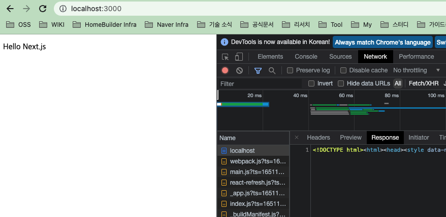

# Next.js 기초 가이드 ( with TypeScript )

# Next.js 란?

- React 기반 프레임 워크로 **서버 사이드 렌더링**을 손쉽게 구성할 수 있도록 다양한 기능을 제공합니다.
  - `pages/` 하위에 있는 페이지 단위들은 Next.js 서버에서 SSR 형태로 HTML 문서를 제공
  - 폴더 / 파일 기반 라우팅을 지원
- 유저는 더이상 첫 화면에서 로딩을 오래 기다리지 않아도 되고, 첫 렌더링 이후에는 CSR 방식을 통해 화면의 깜빡임 없이 사용할 수 있게 됩니다.
- 공식문서: https://nextjs.org/


### 1. 프로젝트 생성하기

- 빠른 진행을 위해 webpack / babel 설정은 하지 않고 진행하겠습니다.

```shell
// package init
npm init -y

// react, next install
npm install react react-dom next

// typescript 
npm install --save-dev typescript @types/react @types/react-dom @types/node

// pages directory add
mkdir pages
```

- `package.json`을 수정합니다.

```json
"scripts": {
    "dev": "next",
    "build": "next build",
    "start": "next start",
},
```

- `tsconfig.json` 파일 생성
  - 빈 파일로 생성합니다!

- 기본 페이지 생성 ( pages/index.tsx )
  - 자동으로 next.js server가 해당 컴포넌트를 첫 페이지로 사용합니다.


```react
const Index = () => (
  <div>
    <p>Hello Next.js</p>
  </div>
);

export default Index;
```

- `npm run dev` => `http://localhost:3000`에서 확인할 수 있습니다.
  - 이 과정에서 `tsconfig.json`파일 내부에 자동으로 next가 타입스크립트 설정을 채워줍니다.
    - `next-env.d.ts` 파일도 생성
  - 네트워크 탭에서 직접 **SSR**이 이루어졌는지 확인해보세요!




### 2. 자동 라우팅

- pages directory 하위에 컴포넌트를 생성하면 자동으로 Path Routing이 되는 것을 확인할 수 있습니다.

- pages/room.tsx

```react
const Index = () => (
  <div>
    <p>Hello a room!</p>
  </div>
);

export default Index;
```

- `http://localhost:3000/room`에서 **SSR** 형태로 페이지를 확인할 수 있습니다.


### 3. 동적 라우팅

- 동적 라우팅도 지원합니다.
- pages directory 하위에 동적 라우팅 전용 폴더를 생성합니다.
  - pages/dynamic
- pages/dynamic 하위에 `[id].tsx`라는 이름을 가진 컴포넌트를 생성합니다.
  - `pages/dynamic/[id].tsx`
  - Router Path로 전달한 Value를 받아 활용할 수 있습니다.
  - 따로 설정할 필요 없이 자유롭게 아무 Path를 활용해서 접근할 수 있습니다.


```react
import { useRouter } from "next/dist/client/router";

// 접근해보기
// http://localhost:3000/dynamic/1
// http://localhost:3000/dynamic/abc

const Dynamic = () => {
  // useRouter 불러오기
  const router = useRouter();
  
  // path로 전달받은 value 가져오기
  const { id } = router.query;
  
  const moveHome = () => {
  // router.push를 활용해 페이지 이동 가능
    router.push("/");
  };

  return (
    <div>
      <button onClick={moveHome}>홈으로</button>
      <p>Hello Dynamic-{id}</p>
    </div>
  
};
export default Dynamic;
```


### 4. 에러 페이지

#### 4-1 클라이언트 에러

- Next.js는 기본적으로 에러페이지 ( 404 Page )를 제공합니다.
  - 정적 파일로 제공
- 커스텀 방법
  - pages 하위 디렉토리에 `404.tsx` 파일 생성
  - 해당 파일은 빌드 타임에 생성됩니다.
- pages/404.tsx

```tsx
const Error = () => {
  return <div>404 Error!!!</div>;
};

export default Error;
```

#### 4-2 서버 에러

- pages 하위 디렉토리에 ` _error.tsx` 파일 생성
  - 이 파일은 정적으로 제공하지 않고 상황에 따라 Props를 받아 생성해줍니다.
  - 만약 클라이언트 에러 처리 방법인 `404.tsx`가 존재하지 않을 경우 클라이언트 에러도 여기서 처리합니다.
- pages/_error.tsx

```tsx
function Error({ statusCode }) {
  return (
    <p>
      {statusCode
        ? `An error ${statusCode} occurred on server`
        : "An error occurred on client"}
    </p>
  );
}

Error.getInitialProps = ({ res, err }) => {
  const statusCode = res ? res.statusCode : err ? err.statusCode : 404;
  return { statusCode };
};

export default Error;
```


### 5. 환경변수 활용

- Next.js는 환경변수 설정을 제공합니다.
- root 디렉토리에 `.env.development` / .`env.production` 생성
- 클라이언트
  - `NEXT_PUBLIC_변수명`
  - Next.js에서는 `NEXT_PUBLIC_` 접두사를 사용하지 않으면 클라이언트 코드에서 환경 변수 엑세스 불가
- 서버
  - 자유롭게 사용

#### 5-1 예제

- `process.env.변수명`으로 접근
- 클라이언트 컴포넌트

```tsx
const Index = () => {
  // env test
  console.log("client:" + process.env.NEXT_PUBLIC_VALUE);

	...
}
```

- 서버
  - `getServerSideProps()`는 서버에서 실행되는 메소드이며 나중에 자세히 학습하게 됩니다!

```tsx
export const getServerSideProps: GetServerSideProps = async (context) => {
  // env test
  console.log("server: " + process.env.NAME);

  ....
};
```


### 6. 참고 링크

- https://nextjs.org/
- https://www.youtube.com/watch?v=Ujjdn2wMIew
- https://jcon.tistory.com/124
- https://merrily-code.tistory.com/154
- https://velog.io/@devstone/Next.js-100-%ED%99%9C%EC%9A%A9%ED%95%98%EA%B8%B0-feat.-initialProps-webpack-storybook