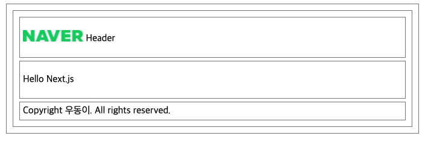

# _app.tsx 와 _document.tsx

- `_app.tsx`, `_document.tsx`: 두 파일은 **server only file** 입니다.

-  Next.js server logic에 사용되는 파일이기 때문에 client에서 사용하는 로직 사용 불가
   -  ex) EventListener / Window / DOM 

### 1. _app.tsx

- 서버로 요청이 들어왔을 때 **가장 먼저 실행되는 컴포넌트**를 의미합니다.
  - `pages/_app.tsx` 경로에 생성
  - 모든 페이지는 이곳을 통하게 되고 **공통 레이아웃**을 만들때 사용
  - 글로벌 CSS 적용

- 레이아웃 설정을 통해 페이지 전환시 **특정 레이아웃을 유지**할 수 있습니다.
  - 페이지 전환시 **특정 레이아웃의 상태값도 유지**


### 실습해보기

- root 경로에 **styles/globals.css** 를 생성합니다.
  - `_app.tsx`에 적용
- pages/_app.tsx 생성
  - props
    - `Component`
      - 현재 페이지를 의미하며 페이지 변경시 해당 Component는 변경됩니다.
    - `pageProps`
      - DataFatching 메서드를 이용해 미리 가져온 초기 객체 입니다.
        - `getInitialProps`, `getStaticProps`, `getServerSideProps` 중 하나를 통해 패칭한 초기 속성값
      - 이 메서드를 사용하지 않으면 빈 객체 전달

```react
import type { AppProps } from "next/app";
import "../styles/globals.css";

const App = ({ Component, pageProps }: AppProps) => {
  return <Component {...pageProps} />;
};

export default App;
```


### 2. component를 활용하여 Layout 꾸미기

- component 경로에 Header / Footer Component를 생성합니다.
- component/header.tsx
  - root 경로에 **public 폴더**를 생성한 후 내부에 폴더 / 파일을 생성하면 static 경로로 접근할 수 있습니다.
    - public 폴더 내부에는 style / html 파일 등 다양한 파일 활용 가능
    - public/images/logo.png 생성 후 Header에 적용


```react
const Header = () => {
  return (
    <div>
      <p>
        
        <span> Header</span>
      </p>
    </div>
  );
};

export default Header;
```

- component/footer.tsx

```react
const Footer = () => {
  return <div>Copyright 우동이. All rights reserved.</div>;
};

export default Footer;
```

- 기존 `_app.tsx` 파일에서 컴포넌트를 적용합니다.
- pages/_app.tsx
  - page가 변경될 때마다 Header와 Footer는 고정되고 Page의 Component만 변경되게 됩니다.

```react
import type { AppProps } from "next/app";
import "../styles/globals.css";
import Header from "../component/header";
import Footer from "../component/footer";

const App = ({ Component, pageProps }: AppProps) => {
  return (
    <div>
      <Header />
      <Component {...pageProps} />
      <Footer />
    </div>
  );
};

export default App;
```




### 3. _document.tsx

- next.js에서 제공하는 **document(html 문서)를 커스터마이징** 할 수 있습니다.
  - 공통적으로 사용할  head / mete 정보 / 폰트 / 웹 접근성 설정 / body 등을 커스터마이징 할 때 활용
  - Content들을 브라우저가 html로 이해하도록 구조화

- `_document`는 `_app` **다음에 실행됩니다.**
- **무조건 서버에서 실행되는 파일이므로 브라우저 API / 이벤트 핸들러 등 포함된 코드들은 실행되지 않습니다.**
- `<Main />` 태그를 제외한 부분은 브라우저에서 실행되지 않기 때문에 이곳에는 비즈니스 로직을 추가하면 안됩니다.
- `_app.tsx`가 실행되면서 갖추어진 content들은 Main Component 아래에 생성
- pages/_document.js
  -  Document 클래스를 상속받는 클래스 컴포넌트로 작성
  -  렌더 함수는  `<Html>`, ` <Head>`, ` <Main>`, ` <NextScript>` 요소를 리턴해야 합니다.
  -  `<Head>` 태그는 next/head가 아닌 next/document 모듈에서 불러와야 합니다.
     -  두 개의 Head는 다름으로 Head의 Ttitle 설정은 여기서 할 수 없습니다.
     -  `<Head>` 태그에는 모든 문서에 공통으로 적용할 (charset, 뷰포트 메타태그 등)이 들어갑니다.

```react
import Document, { Html, Head, Main, NextScript } from "next/document";

class MyDocument extends Document {
  render() {
    return (
      // html 태그에 언어 설정
      <Html lang="ko">
        <Head />
        <body>
          <Main />
          <NextScript />
        </body>
      </Html>
    );
  }
}

export default MyDocument;
```

- 번외) title 설정하기
  - index.js(메인 페이지)에서 title 변경


```react
import Head from "next/head";

const Index = () => (
  <div>
    <Head>
      <title>Next</title>
    </Head>
    <p>Hello Next.js</p>
  </div>
);

export default Index;
```


### 4. 첫 페이지에서 api 요청 및 상태 관리

- axios 설치

```
npm install axios
```

- component/itemList.tsx 생성
  -  API 요청 후 Data를 표시할 컴포넌트
  - `Link`를 활용하여 해당 아이템 클릭 시 이동할 경로를 지정합니다. ( 동적 라우팅 활용 )

```tsx
import Link from "next/link";

interface IInfo {
  id: number;
  name: string;
}

interface IProps {
  data: IInfo[];
}

const ItemList = ({ data }: IProps) => {
  return (
    <div>
      {data.map((data) => (
        <Link href={`/dynamic/${data.id}`} key={data.id}>
          <div key={data.id}>{data.name}</div>
        </Link>
      ))}
    </div>
  );
};

export default ItemList;
```

- index.tsx 적용
  - 메인 페이지에 API 요청을 통해 불러온 Item List를 볼 수 있게 됩니다.
    - 일반적인 React 처럼 동작
  - 또한 해당 Item 클릭 시 동적 라우팅을 활용하여 특정 페이지로 이동하게 됩니다.

```jsx
import { useState, useEffect } from "react";
import axios from "axios";
import Head from "next/head";
import ItemList, { IItem } from "../component/itemList";

const Index = () => {
  // 임시 API URL
  const API_URL =
    "http://makeup-api.herokuapp.com/api/v1/products.json?brand=maybelline";

  // 상태 생성
  const [list, setList] = useState<IItem[]>([]);

  // API 요청 후 상태에 저장
  const getData = () => {
    axios.get(API_URL).then((res) => {
      setList(res.data);
    });
  };

  useEffect(() => {
    getData();
  }, []);

  return (
    <div>
      <Head>
        <title>Next</title>
      </Head>
      <p>Hello Next.js</p>
      {/* // 아이템 리스트 컴포넌트 추가 및 프롭스로 list 전달 */}
      <ItemList data={list} />
    </div>
  );
};

export default Index;
```

