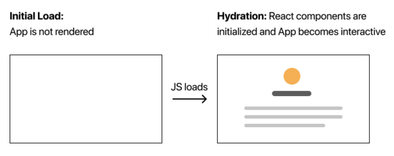
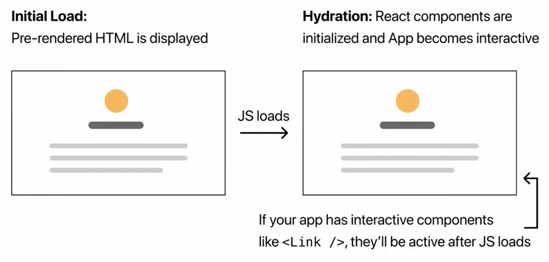

# Pre-rendering

- Next.js는 기본적으로 모든 페이지를 사전에 렌더링 진행 **( Pre-rendering )**

  - 미리 서버에서 HTML 문서를 만들어서 클라이언트에게 제공

- 페이지를 가져올 때 데이터 패칭이 필요한 경우(pre-rendering) `getInitialProps`, `getStaticProps`, `getStaticPath`, `getServerSideProps` 등을 활용

  - 미리 서버에서 API를 통해 가져온 데이터를 매핑하여 HTML 문서를 전달
  - 모든 페이지에 공통으로 적용할 경우 `_app.tsx`에서 데이터 패칭을 진행
  - **SEO 활성화**

  

### 0. ServerSide Cycle

- Next Server에게 Get 요청
- 요청에 맞는 Page 찾기
- `_app.tsx`에서 데이터 패칭 함수(`getInitialProps`)가 존재한다면 실행 및 `pageProps`를 받아서 처리
- Page의 Component 내부에 데이터 패칭 함수(`getInitialProps`)가 존재한다면 실행 및 `pageProps`를 받아서 처리
- `pageProps`를 바탕으로 `_app.tsx` / `Page Component` 순으로 렌더링 진행
- 마지막으로 `_document.tsx`를 실행하여 최종 HTML 문서를 완성 및 반환


### 1. Pre-rendering

- No Pre-rendendering
  - 자바스크립트가 로드 된 후 화면이 그려집니다.



- Pre-rendering
  - 기본적인 HTML 문서를 완성 후 자바스크립트를 로드 



### 2. Pre-rendering 종류

- Next.js는 2가지 방법을 제공합니다.

  - Static Generation: HTML 문서를 빌드타임에 생성한 후 요청시마다 재사용하는 방법 ( 첫번째 접속시 엄청 빠름 )
    - 퍼포먼스를 위해 Next.js는 이 방식을 권장
    - 정적으로 생성된 페이지들은 CDN에 캐시 가능
    - `getStaticProps` / `getStaticPaths` 활용
    - 참고: dev환경에서는 계속 호출!

  - Server-side Rendering: 요청시마다 HTML문서를 생성하는 방법
    - 항상 최신 상태의 HTML 문서 유지
    - `getServerSideProps` 활용

- Next.js는 페이지 별로 어떤 **Pre-rendering**을 선택할지 개발자가 정의할 수 있고 상황에 맞게 적절하게 사용하는 것이 중요합니다.


### 3. Server-side Rendering

- 기존의 `pages/dynamic/[id].tsx` 에서 `getServerSideProps` 함수를 정의합니다.
  - `getServerSideProps()` 는 서버에서 동작하고 내부는 Node.js 환경입니다.
  - Dynamic 컴포넌트는  `getServerSideProps()`가 return 한 data를 props로 받을 수 있습니다.
  - 즉 빌드와 상관없이 **매번 요청마다 데이터를 서버로부터 가져와 최신상태를 유지**합니다.
    - **빌드 후 데이터 변경 가능**
- 서버에서 API호출 후 html 문서를 완성한 뒤 html페이지만 내려줍니다
- `npm run build && npm run start` 스크립트를 통해 Production 환경에서 테스트를 진행하면 이미 HTML문서에 API로 받아온 데이터를 채운 후 반환하는 모습을 볼 수 있습니다. 
  - 하지만 매번 요청시마다 HTML 문서를 생성하다보니 문서를 요청하여 불러오는 속도가 느립니다.

```tsx
import { GetServerSideProps } from "next";
import { useRouter } from "next/dist/client/router";
import axios from "axios";

// props 받기
const Dynamic = ({ item }) => {
  // item 확인
  console.log(item);
  
  const router = useRouter();

  const moveHome = () => {
    router.push("/");
  };

  return (
    <div>
      <button onClick={moveHome}>홈으로</button>
      <p>id: {item.id}</p>
      <p>name: {item.name}</p>
    </div>
  );
};

export default Dynamic;

// getServerSideProps() 정의
export const getServerSideProps: GetServerSideProps = async (context) => {
  // context 객체 내부에는 params, url, query 등 다양한 정보가 존재
  
  const id = context.params.id;
  const API_URL = `http://makeup-api.herokuapp.com/api/v1/products/${id}.json`;
  const response = await axios.get(API_URL);
  const data = response.data;

  return {
    props: {
      item: data,
    },
  };
};
```


### 4. Static Generation

- 빌드타임 환경에 서버에서 API를 호출한 후 HTML 문서에 해당 데이터를 넣어서 완성 후 HTML 페이지를 반환합니다.
  - 미리 만들어진 정적 문서 제공 ( **빌드 타임이 늘어나지만 빠르게 페이지를 받아볼 수 있음** )
  - 재 요청시 서버에서 미리 만들어 놓은 **정적 문서를 재사용**합니다.
- `getStaticProps` / `getStaticPaths` 를 활용합니다.

#### 4-1 `getStaticProps` 활용

- pages/index.tsx
  - `npm run build && npm run start` 스크립트를 통해 Production 환경에서 테스트를 진행하면 이미 HTML문서에 API로 받아온 데이터를 채운 후 반환하는 모습을 볼 수 있습니다. 
    - 이미 빌드 타임에 정적 HTML 문서를 완성한 상태이니 **빠르게 HTML 문서를 받아볼 수 있습니다.**

```tsx
import { GetStaticProps } from "next";
import axios from "axios";
import Head from "next/head";
import ItemList from "../component/itemList";

// props로 getStaticProps()가 return 한 data를 받을 수 있습니다.
const Index = ({ list }) => {
  return (
    <div>
      <Head>
        <title>Next</title>
      </Head>
      <p>Hello Next.js</p>

      <ItemList data={list} />
    </div>
  );
};

export default Index;

// getStaticProps() 정의
export const getStaticProps: GetStaticProps = async () => {
  const API_URL = `http://makeup-api.herokuapp.com/api/v1/products.json?brand=maybelline`;
  const response = await axios.get(API_URL);
  const data = response.data;

  return {
    props: {
      list: data,
    },
  };
};

```

#### 4-2 `getStaticPaths` 활용

- 앞에서 소개했던 Path를 활용한 동적 라우팅을 활용할 때 **특정 Path  Page에 대해서도 static generation를 지원**
- 예시
  - 모든 Item 정보를 static generation 하고 싶지만 이렇게 되면 빌드 타임이 늘어나기 때문에 특정 Item만 **static generation** 진행
- Pages/dynamic/[id].tsx
  - `getStaticPaths`의 프로퍼티
    - `paths`: 배열에 등록된 Path는 static generation 적용 => 빌드 타임에 미리 정적 문서 생성
      - 미리 빌드 타임에 API 요청 후 정적 문서 생성
        - http://localhost:3000/dynamic/495
        - http://localhost:3000/dynamic/498
    - `fallback: boolean`: 위의 paths 배열에 선언한 path 이외에 다른 path가 들어올 경우 처리 방법
      - `false`: 404 Error 발생
      - `ture`: 첫 진입시 정적 문서를 만들고 위 paths에 등록 => 두번째 진입시 정적 문서 활용
        - 첫번째로 해당 Path에 접속할 때 API를 호출 후 정적문서를 만들기 때문에 속도가 느리지만 두번째 접속시에는 그대로 정적문서를 재활용하기 때문에 속도가 빨라집니다.
  - 정적 문서가 생기지 않은 Path의 경우 `router.isFallback`을 활용하여 Loading을 구현할 수 있습니다.
    -  Next가 제공하는 `useRouter()`에서 제공합니다.
    - `true`: 아직 `getStaticProps`를 통해 데이터를 받아오지 못한 경우
    - `false`: `getStaticProps`를 통해 데이터를 받아온 경우

```tsx
import { GetStaticProps, GetStaticPaths } from "next";
import { useRouter } from "next/dist/client/router";
import axios from "axios";

const Dynamic = ({ item }) => {
  
  const router = useRouter();

  const moveHome = () => {
    router.push("/");
  };
  
  // loading 구현 가능
  const loading = router.isFallback;
  
  return (
    <div>
      {item && (
        <>
          <button onClick={moveHome}>홈으로</button>
          <p>id: {item.id}</p>
          <p>name: {item.name}</p>
        </>
      )}
    </div>
  );
};

export default Dynamic;

// getStaticPaths() 생성
export const getStaticPaths: GetStaticPaths = async () => {
  return {
    paths: [{ params: { id: "495" } }, { params: { id: "488" } }],  			
    fallback: true,
  };
};

// getServerSideProps() => getStaticProps()로 변경
export const getStaticProps: GetStaticProps = async (context) => {
  const id = context.params.id;
  const API_URL = `http://makeup-api.herokuapp.com/api/v1/products/${id}.json`;
  const response = await axios.get(API_URL);
  const data = response.data;

  return {
    props: {
      item: data,
    },
  };
};
```


#### 4-3 `getStaticPaths` 과 Next Link

- 바로 위의 코드를 작성하고 테스트를 진행해보면 Path로 설정한 `id: 495 / id: 488`이외에 **모든 Item 들이 static generation으로 적용되어 정적 문서를 가지고 있습니다.**

- 이유는 동적 라우팅을 활용하기 위해 사용한 `Link` 태그 때문입니다.
  - Next가 제공하는 `Link` 태그는 기본적으로 `Prefetch` 옵션을 제공합니다.
    - 기본적으로 선언하지 않으면 `true`로 설정
    - `Prefetch` 옵션:  첫 화면 / 스크롤 했을 때 **뷰포트 내부에 있는 링크들은 모두 pre-renderring 및 static generation 진행**

- component/itemList.tsx

```tsx
import Link from "next/link";

export interface IItem {
  id: number;
  name: string;
}

export interface IProps {
  data: IItem[];
}

const ItemList = ({ data }: IProps) => {
  return (
    <div>
      {data.map((data) => (
        // Link를 적용했기 때문에 모든 Item이 static generation 적용되어 모두 정적문서 생성
        <Link href={`/dynamic/${data.id}`} key={data.id}>
          <div key={data.id}>{data.name}</div>
        </Link>
      ))}
    </div>
  );
};

export default ItemList;
```


### 5. `getInitialProps`

- Next.js의 9.3v 이전에 자주 사용했던 데이터 패칭 방법입니다.
- 현재는 모든 페이지의 전역에 데이터 패칭이 필요한 경우 `_app.tsx`에서 활용합니다.
  - `_app.tsx`에서는 `getStaticProps` /  `getServerSideProps` 를 지원하지 않습니다.
  - 또한 `getStaticProps` /  `getServerSideProps` 자체는 전역적인 데이터 패칭 기능을 지원하지 않고 페이지 단위로 지원합니다.

- `_app.tsx`에서 `getInitialProps`를 사용한다면 **Automatic Static Optimization**이 비활성화되어 모든 페이지가 Pre-rendering 방식이 Server Side Rendering으로 동작하게 됩니다.
  - [Automatic Static Optimization]([공식문서](https://nextjs.org/docs/advanced-features/automatic-static-optimization)): Next.js는 데이터 패칭 요구사항이 없으면 페이지가 정적인지 확인 후 데이터 패칭 함수를 사용하지 않는다면 **Static Generation 방식을 사용하여 사전에 HTML 문서를 제공하여 최적화를 진행**합니다.
  - 한 페이지가 빌드될 때 하나의 `getInitialProps`만 실행됩니다.
    - 즉 `_app.tsx`에 `getInitialProps`가 선언되어 있고 다른 하위 페이지에 `getInitialProps`가 선언되어 있을 경우 하위 페이지의 `getInitialProps`은 실행되지 않습니다.

- Pages/_app.tsx
  - `getInitialProps`의 `context`
    - `ctx`: 다양한 정보를 담고 있는 객체
      - `pathname`: 현재 page의  path
      - `query`: 현재 page의 query
      - `asPath`: pathname + query
      - `req`: request message
      - `res`: request message
      - `err`: error message
    - `Component`: 해당 컴포넌트를 의미

```tsx
import type { AppProps } from "next/app";
import "../styles/globals.css";
import Header from "../component/header";
import Footer from "../component/footer";

// PageProps는 모든 Page에서 활용 가능
const App = ({ PageProps }: AppProps) => {
  return (
    <div>
      <Header />
      <Component {...pageProps} />
      <Footer />
    </div>
  );
};

export default App;

App.getInitialProps = async (context) => {

  const { ctx, Component } = context;
  let pageProps = { props: "test" };

  // return한 값은 해당 컴포넌트의 props로 들어가게 됩니다.
  return { pageProps };
};
```

